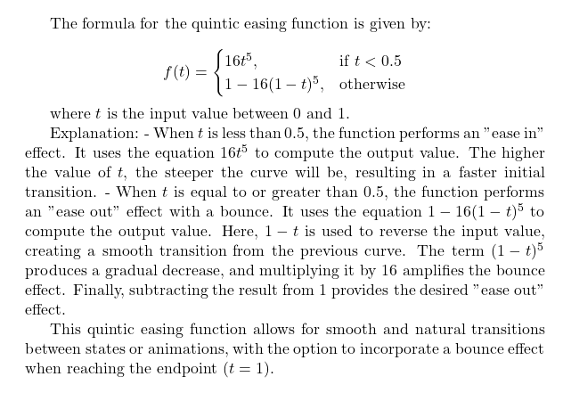

Explanation:
- When \(t\) is less than 0.5, the function performs an "ease in" effect. It uses the equation \(16t^5\) to compute the output value. The higher the value of \(t\), the steeper the curve will be, resulting in a faster initial transition.
- When \(t\) is equal to or greater than 0.5, the function performs an "ease out" effect with a bounce. It uses the equation \(1 - 16(1-t)^5\) to compute the output value. Here, \(1-t\) is used to reverse the input value, creating a smooth transition from the previous curve. The term \((1-t)^5\) produces a gradual decrease, and multiplying it by 16 amplifies the bounce effect. Finally, subtracting the result from 1 provides the desired "ease out" effect.

This quintic easing function allows for smooth and natural transitions between states or animations, with the option to incorporate a bounce effect when reaching the endpoint (\(t = 1\)).

